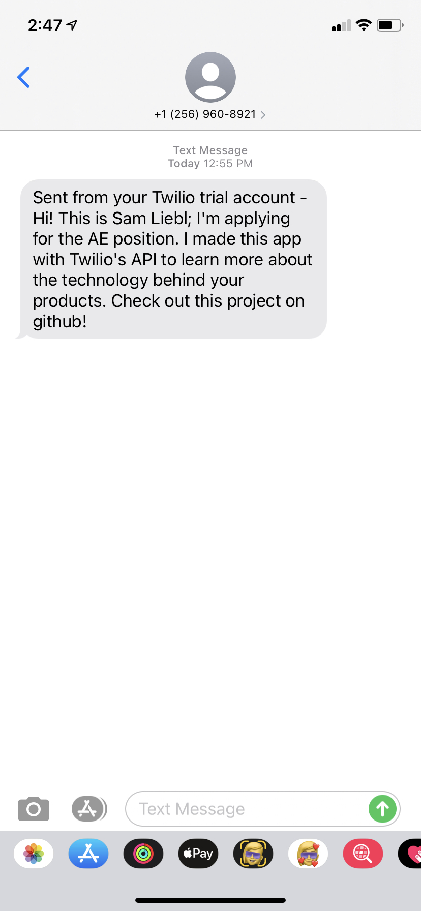

# Twilio Test Project

To learn more about Twilio's technology, I'm starting out by familiarizing myself with their SMS API. This project uses the guide "[Programmable SMS Quickstart for Node.js](https://www.twilio.com/docs/sms/quickstart/node)" from Twilio's documentation.

Working through the process, I sent myself a test text message:

